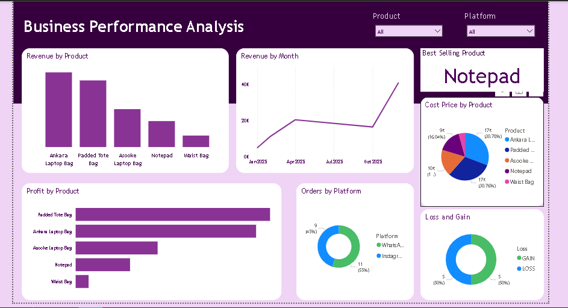

# Business_Performance_Analysis

## Project Overview
As a business owner, I noticed that while sales were happening, I wasn't sure which products were actually making money. I built this project to identify "profit-drainers" and double down on high-value products.

## Tools Used
* **Excel:** Data cleaning and preparation.
* **Power BI:** Data modeling and interactive dashboarding.

## Key Business Insights
After analyzing my sales data, I discovered a few things:. **Underpricing:** Several high-volume products were priced too low, resulting in thin margins.
**Hidden Gems:** I identified "Most Loved" products that have high customer loyalty and high profit—I am now prioritizing these for marketing.
**Product Optimization:** I found specific items that generated revenue but zero profit due to hidden costs.
**The "Profit Hero":** While the Ankara Laptop Bag brings in the most revenue, the Padded Tote Bag is actually my most profitable product.
**The Best Seller vs. Profit:** Interestingly, the Notepad is the "Best Selling Product" by volume, but it generates significantly less profit than the bags.
**Platform Performance:** Most of my orders come through WhatsApp (55%), followed closely by Instagram (45%). This shows me exactly where to focus my marketing energy.
**Pricing Strategy:** The Loss and Gain chart shows an even split (50/50). This confirms that the products or sales are currently categorized as Loss, indicating a desperate need for a price increase or cost reduction.

## The Impact
By adjusting my pricing strategy based on these insights, I am now focusing on the products that actually grow the bottom line rather than just increasing sales volume.

## 📊 Dashboard Preview

